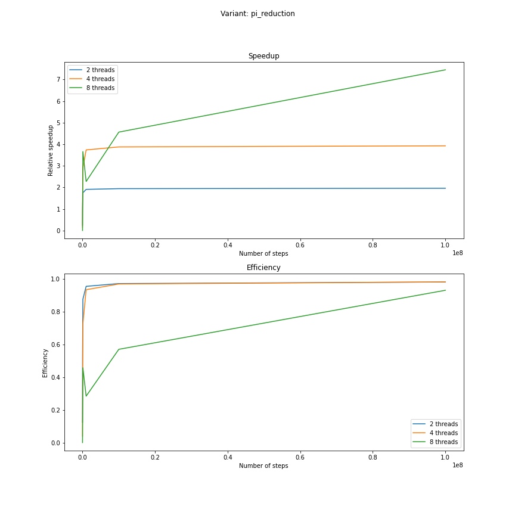
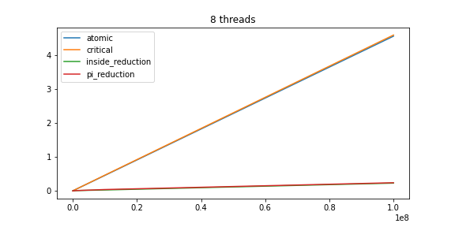

# Montecarlo simulation for PI

The omp implementation of pi calculation can be found in [pi_omp.c](pi_omp.c)

## Measure execution times with different optimizations

I measured execution with the following optimization approaches:

- atomic increment of the inside points
- incrementing inside points in a critical region
- using `reduction` on the number of inside points
- using `reduction` on the intermediate results for pi

Every variant was run with 1,2,4, and 8 threads respectively.

Plotting the thread numbers against each other within a variant highlights problem with `atomic` and `critical`.

### Atomic performance plot

### Critical performance plot:

## Optimization strategies

Because most of the computation is completely independent, I think reduction is the way to go.
I used the same strategy for the MPI kernel to which I compared.

### Pi reduction plot

### Internal points reduction plot

### Comparing variants

We know that reduction is much faster than mutually exclusive value updates.
It is then interesting to compare reduction on Pi vs. reduction on the number of points inside the circle.
The plot looks as follows (shown here for 8 threads):

We see that there is virtually no difference between reducing `pi` and reducing `inside`.
However, looking at the numbers, we can see that reducing `inside` is marginally faster, and so it is the time I posted in the list.

## Compare to MPI variant

I don't have a plot for this part, but the time for 8 threads using MPI is basically the same as 8 threads and reduction.
