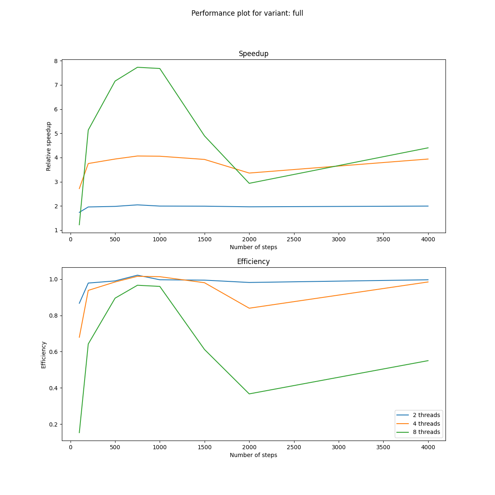

# 2D Stencil

The Open MP implementation can be found in [omp_stencil_2d.c](omp_stencil_2d.c).

## Execution time plot



## Performance optimization

Shown below is a single step of the loop, which I parallelized with OMP

```C
#pragma omp parallel for collapse(2) schedule(static)
        for (int i = north; i < south; ++i)
        {
            for (int j = west; j < east; ++j)
            {
                int y_above = i != 0 ? i - 1 : 0;
                int y_below = i != N - 1 ? i + 1 : N - 1;
                int x_left = j != 0 ? j - 1 : 0;
                int x_right = j != N - 1 ? j + 1 : N - 1;

                value_t tc = A[i * N + j];
                value_t tl = A[i * N + x_left];
                value_t tr = A[i * N + x_right];
                value_t tu = A[y_above * N + j];
                value_t td = A[y_below * N + j];

                // printf("%d: t=%d, i=%d, j=%d\n", omp_get_thread_num(), t, i, j);
                B[i * N + j] = tc + 0.4 * .25 * (tl + tr + tu + td - 4 * tc);
            }
        }
```

I used collapse to simplify the loops for OMP.
I also switched scheduling to static in the hopes of reducing overhead, as all steps should take exactly the same time.

I tried using `simd` instead of parallel, but that didn't improve performance for multiple threads.
It could be that using `simd` for the inner loop would have helped, but I thought of it too late to try.

## Comparison to MPI

OMP runs just as fust as MPI for 8 ranks, but at a much lower programming cost.

## Optimizing for the posted problem in the spreadsheet

The problem posted in the spreadsheet has an extremely low number of timesteps for the problem size.
This is important for our initialization case of a single heat source.

Every cell except for the heat source location is 0 (or 273) at the start.
In every time step, the heat propagates outward one cell.
This means that for `T` timesteps we need to consider a `(T+1)*(T+1)` rectangle.
For the posed problem this leads to a reduction to `200*200` instead of `4000*4000`.

To apply this optimization I calculate a north, south, east, and west coordinate, and use that as my loop delimiters.
If `T` becomes so large that the entire field must be calculated, then the results are the same.
