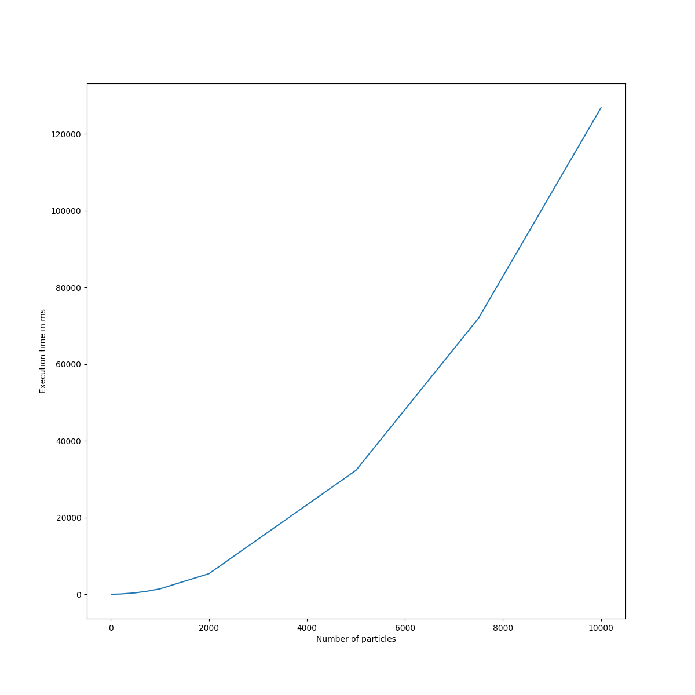

# Assignment 5

## Task 1: sequential implementation

The sequential implementation of my nbody simulation can be found [here](nbody.cpp).
My base algorithm has quadratic complexity, as every particle (star) is tested against every other star when calculating updates.
The two nested loops iterate over the indices of the particle vector (use of iterators, see below), where the inner loop skips indices already covered by the outer loop.
This reduces complexity somewhat, as we update forces for both particles anyway.

I focussed primarily on ease of programming and wrote the code in C++, using structs for the particles.
The code was compiled with `-O2 -ffast-math -std=c++11`.

I have an optional optimization where I combine stars closer than _EPSILON_ into one.
This optimization reduces execution time from 126s to ca. 4s, but makes optimization much less interesting, and seems unfair for our competition.
I'm also unsure whether the newly calculated velocity is entirely accurate (I only used conservation of momentum, and skipped conservation of energy due to laziness).
The performance of this optimization also depends on the ratio of particles per area.

### Execution times

The execution time plot very nicely shows the quadratic complexity of my implementation.
I don't see any clear jumps for problem sizes, e.g. due to switching to a different layer in the memory hierarchy.
My structs are 20 Byte large (5 floats, also reported by sizeof).
This would mean that over 600k elements fit in the L2 cache, so we're probably never leaving that lever of the cache hierarchy.

## Task 2: preparation of optimization

My idea is to split the entire 2D space into grid cells, and calculate interactions within grid cells.
At the same time, I would calculate the center of mass for the grid cells.
In the next step every particle in every other grid cell is updated using the centers of gravity of the other grid cells.
This does add some inaccuracy, but I would argue that that's bearable, and can be adjusted with the number of grid cells.
One important thing to keep in mind is that occupancy of grid cells may change as the stars move, but that should befine.

When paralellized, this should average case complexity by a lot (even though it's still quadratic).
Parallelization can then easily happening with OpenMP by parallelizing the for loop that iterates over the cells.
Synchronization needs to happen after the centers of gravity are calculated, but the update loop can again be parallelized.

I'm unsure what to do to utilize locality better.
I don't think moving away from using structs would help, too much, as we need all information of a particle for a single update.
The L2 cache of the processors in the cluster is 12MB large, this can fit the entirety of 10k elements, but for larger problem sizes I can increase the number of grid cells to keep memory consumption per core under 12MB.

### Alternative, simpler, idea

Alternatively, I could duplicate the particles, making one set readonly per iteration.
Computation can then be parallelized in the same way that we did for the stencil computation, ideally with tiling loops.
Tiling happens somewhat implicitly wit my first parallelization idea.
