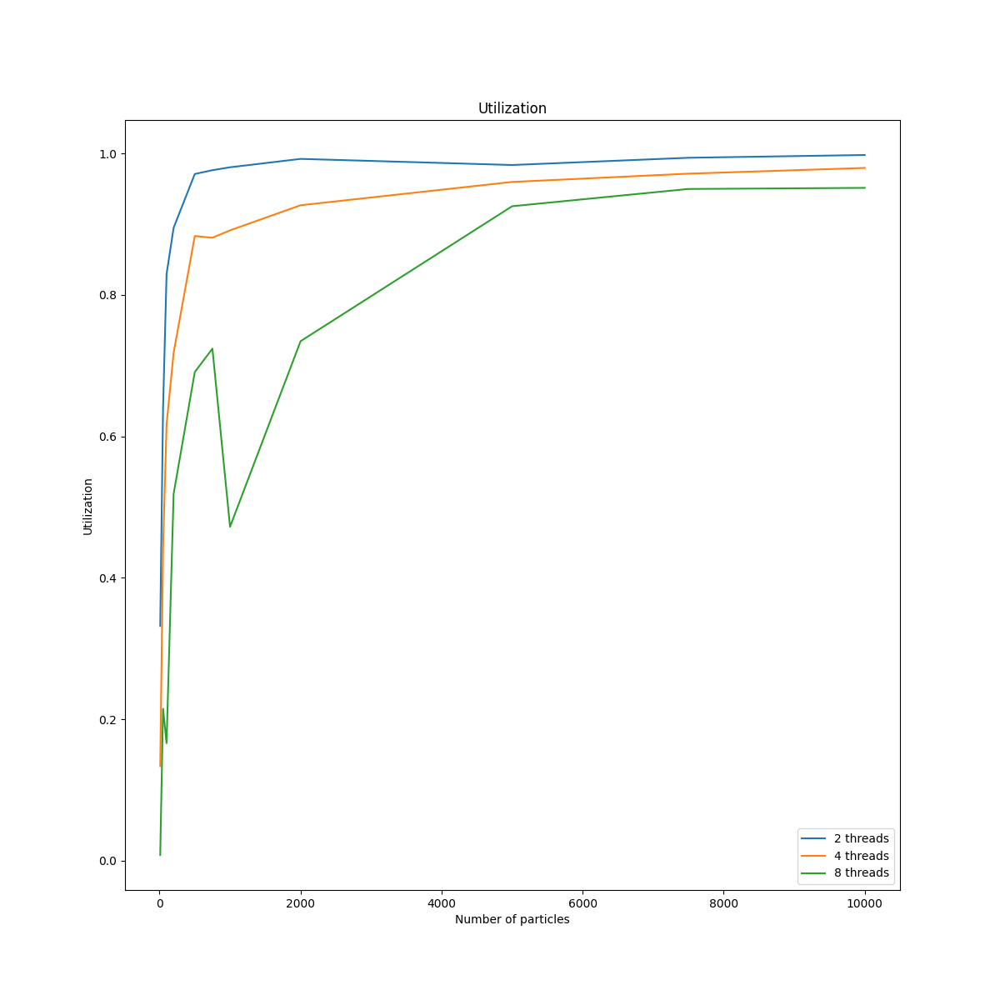

# Assignment 6: optimized N-body

## Exercise 1

### Parallel implementation

I didn't implement a full Barne-Hut algorithm.
Instead, I split the full simulation area in 64 blocks, and assigned each particle a block based on their starting position.
A single step is computed in two parallelized loops (three with balancing):

1. compute interaction between particles in the same block, and compute the center of mass of the block
1. interact particle in a block with the centers of mass of each other block

By splitting this in two parallelized loops, there is an implicit barrier in between, and the centers of mass are updated correcly.

### Measure the speedup

The following is a plot of the speedup.
Because the parallelized algorithm is much faster, even with only one thread, that is the baseline I will compare the speedup to.

And a plot of the utilization:

The utilization is relatively high, above 80% for problem sizes above 4000 particles (for 8 threads).
I haven't looked at the exact value, but it seems to stabilize at around 90%.
This indicates a maximum speedup of x10.

I verified this on my local machine with 12 cores and hyperthreading:

The utilization also drops significantly for more than 8 threads, however the number of blocks is then no multiple of the number of cores anymore, so that is intuitive.

## Exercise 2

### Add spatial load imbalance

To do this I changed the coordinate distribution so that every particle is assigned the first block.

### Mitigate the load imbalance

To mitigate the load imbalance I compute which particles have left their currently assigned block, and assign them to the new block.
The computation of which particles to reassign needs to happen single threaded with my use of an `std::array<vector<Particle>, num_blocks>`, as OpenMP synchronization doesn't seem to work with modifying accesses to those vector's functions, so that caused me to get double free and memory corruption errors.

So instead I create a vector of new particles for each block in a single thread, and then parallelize the updates (lines 202-239 in [nbody.cpp](nbody.cpp)).

### Illustrate the data

The following is a plot of the execution times of imbalanced single threaded, imbalanced with 8 OMP threads, and rebalanced 8 OMP threads.
Rebalancing happens every 10 timesteps.

